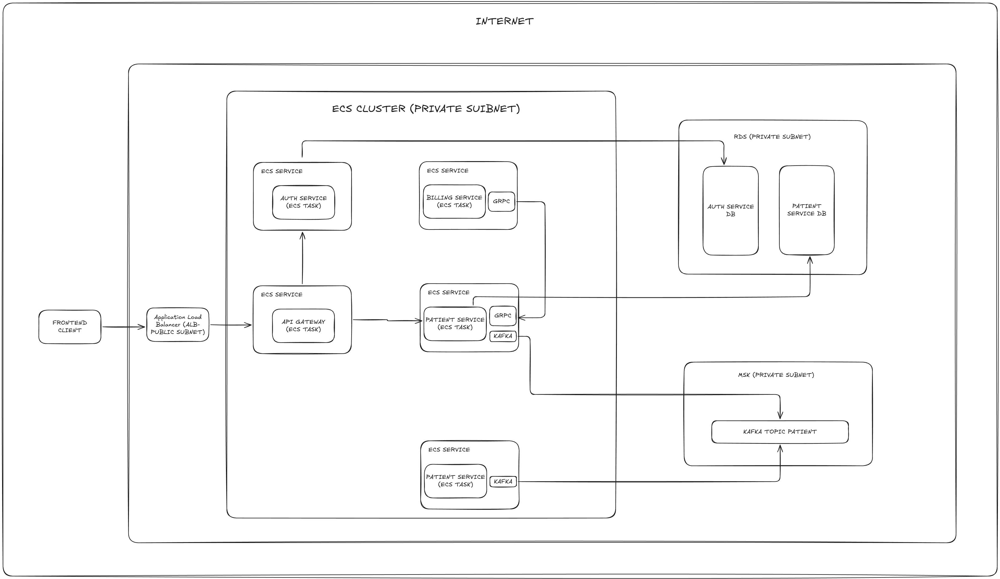

# Patient Management System - Personal Branding & Learning Portfolio

This project is a comprehensive microservices architecture designed to demonstrate and solidify key modern Java backend technologies critical for fintech and enterprise applications. It serves as a personal learning portfolio focusing on Infrastructure as Code (IaC), Java Spring Boot, Message Brokers (Kafka), gRPC, and modern database practices.

## Key Learning Objectives (Focus Areas)

The primary goal of this project is **not just to build a patient management system, but to master the following technical competencies** for fintech readiness:

1. **Infrastructure as Code (IaC) with AWS CDK**: Provisioning production-grade cloud infrastructure programmatically.
2. **Java Spring Boot**: Building robust, scalable microservices.
3. **Message Brokers (Kafka)**: Implementing event-driven architectures.
4. **gRPC**: High-performance inter-service communication.
5. **Modern Databases (PostgreSQL)**: Relational database design, JPA/Hibernate ORM, and RDS integration.

## System Architecture

The system is designed with a cloud-native microservices approach, deployed on AWS:

### Architecture Components

1. **Frontend Client**: User interface for interacting with the system.
2. **Application Load Balancer (ALB)**: Public-facing entry point, routing traffic to API Gateway.
3. **API Gateway**: Single entry point for all microservices, handling routing and JWT validation.
4. **ECS Cluster (Private Subnet)**: Container orchestration using AWS ECS with Fargate for running microservices.
5. **Microservices**:
   - **Auth Service**: Handles user authentication and authorization (JWT).
   - **Patient Service**: Manages patient data, integrates with Billing via gRPC, and produces events to Kafka.
   - **Billing Service**: gRPC service for billing operations.
   - **Analytics Service**: Kafka consumer for processing patient events.
6. **RDS (Private Subnet)**: PostgreSQL databases for Auth Service and Patient Service.
7. **MSK (Private Subnet)**: Managed Kafka cluster for event streaming.

## Project Structure & Services

Let's break down each folder and its purpose:

### 1. `api-gateway/`
**Purpose**: Acts as a single entry point for all client requests, routing to appropriate microservices and validating JWT tokens.

**Key Learnings**:
- Spring Cloud Gateway for API routing
- Custom gateway filters for JWT validation
- Reactive programming with Project Reactor

**Tech Stack**:
- Java 21
- Spring Boot 3.4.1
- Spring Cloud Gateway

### 2. `auth-service/`
**Purpose**: Handles user registration, login, and JWT token generation/validation.

**Key Learnings**:
- Spring Security for authentication and authorization
- JWT (JSON Web Token) implementation
- Spring Data JPA with PostgreSQL
- Database initialization with `data.sql`

**Tech Stack**:
- Java 21
- Spring Boot 3.5.16
- Spring Security
- Spring Data JPA
- PostgreSQL
- H2 (for testing)
- JJWT library

**Core Files**:
- [SecurityConfig.java](file:///c:/Users/rahma/portfolio/patient-management/auth-service/src/main/java/com/pm/authservice/config/SecurityConfig.java): Security configuration
- [AuthController.java](file:///c:/Users/rahma/portfolio/patient-management/auth-service/src/main/java/com/pm/authservice/controller/AuthController.java): Authentication endpoints
- [JwtUtil.java](file:///c:/Users/rahma/portfolio/patient-management/auth-service/src/main/java/com/pm/authservice/util/JwtUtil.java): JWT token utility

### 3. `patient-service/`
**Purpose**: Manages patient CRUD operations, integrates with Billing Service via gRPC, and produces events to Kafka.

**Key Learnings**:
- REST API development with Spring Web
- gRPC client implementation
- Kafka producer for event-driven architecture
- Data validation with Spring Validation
- Exception handling with `@ControllerAdvice`
- DTO pattern and mapping

**Tech Stack**:
- Java 21
- Spring Boot 3.5.14
- Spring Data JPA
- Spring Validation
- gRPC
- Spring Kafka
- PostgreSQL
- H2 (for testing)

**Core Files**:
- [PatientController.java](file:///c:/Users/rahma/portfolio/patient-management/patient-service/src/main/java/com/pm/patientservice/controller/PatientController.java): Patient REST endpoints
- [BillingServiceGrpcClient.java](file:///c:/Users/rahma/portfolio/patient-management/patient-service/src/main/java/com/pm/patientservice/grpc/BillingServiceGrpcClient.java): gRPC client for Billing Service
- [KafkaProducer.java](file:///c:/Users/rahma/portfolio/patient-management/patient-service/src/main/java/com/pm/patientservice/kafka/KafkaProducer.java): Kafka event producer
- [GlobalExceptionHandler.java](file:///c:/Users/rahma/portfolio/patient-management/patient-service/src/main/java/com/pm/patientservice/exception/GlobalExceptionHandler.java): Global exception handling

### 4. `billing-service/`
**Purpose**: Provides gRPC service for billing operations.

**Key Learnings**:
- gRPC server implementation
- Protocol Buffers (Protobuf) for service definition
- High-performance inter-service communication

**Tech Stack**:
- Java 21
- Spring Boot 3.5.15
- gRPC
- Protobuf

**Core Files**:
- [BillingGrpcService.java](file:///c:/Users/rahma/portfolio/patient-management/billing-service/src/main/java/com/pm/billingservice/grpc/BillingGrpcService.java): gRPC service implementation
- [billing_service.proto](file:///c:/Users/rahma/portfolio/patient-management/billing-service/src/main/proto/billing_service.proto): Protobuf service definition

### 5. `analytics-service/`
**Purpose**: Consumes patient events from Kafka for analytics processing.

**Key Learnings**:
- Kafka consumer implementation
- Event-driven architecture patterns
- Processing streaming data

**Tech Stack**:
- Java 21
- Spring Boot 3.5.16
- Spring Kafka
- Protobuf

**Core Files**:
- [KafkaConsumer.java](file:///c:/Users/rahma/portfolio/patient-management/analytics-service/src/main/java/com/pm/analyticsservice/kafka/KafkaConsumer.java): Kafka event consumer

### 6. `infrastructure/`
**Purpose**: Infrastructure as Code (IaC) using AWS CDK to provision all cloud resources.

**Key Learnings**:
- AWS CDK for programmatic infrastructure provisioning
- VPC design with public and private subnets
- AWS ECS Fargate for container orchestration
- AWS RDS for managed PostgreSQL databases
- AWS MSK for managed Kafka clusters
- CloudWatch logging for containerized applications
- Dependency management between resources

**Tech Stack**:
- Java 21
- AWS CDK 2.178.1
- AWS SDK for Java

**Core Files**:
- [LocalStack.java](file:///c:/Users/rahma/portfolio/patient-management/infrastructure/src/main/java/stack/LocalStack.java): Main CDK stack defining all infrastructure resources

### 7. `integration-test/`
**Purpose**: Integration tests for microservices.

**Key Learnings**:
- Integration testing strategies for microservices
- Testing REST endpoints

### 8. `assets/`
**Purpose**: Contains project assets, including the architecture diagram.

## Why This Matters for Fintech

Fintech applications demand:
1. **Security**: Auth service with JWT and Spring Security demonstrates secure authentication.
2. **Scalability**: Microservices architecture with ECS allows independent scaling.
3. **Reliability**: Event-driven with Kafka ensures data consistency and fault tolerance.
4. **Performance**: gRPC provides high-performance inter-service communication.
5. **Maintainability**: IaC with AWS CDK ensures reproducible and version-controlled infrastructure.

This portfolio project showcases practical experience with all these critical fintech requirements.
